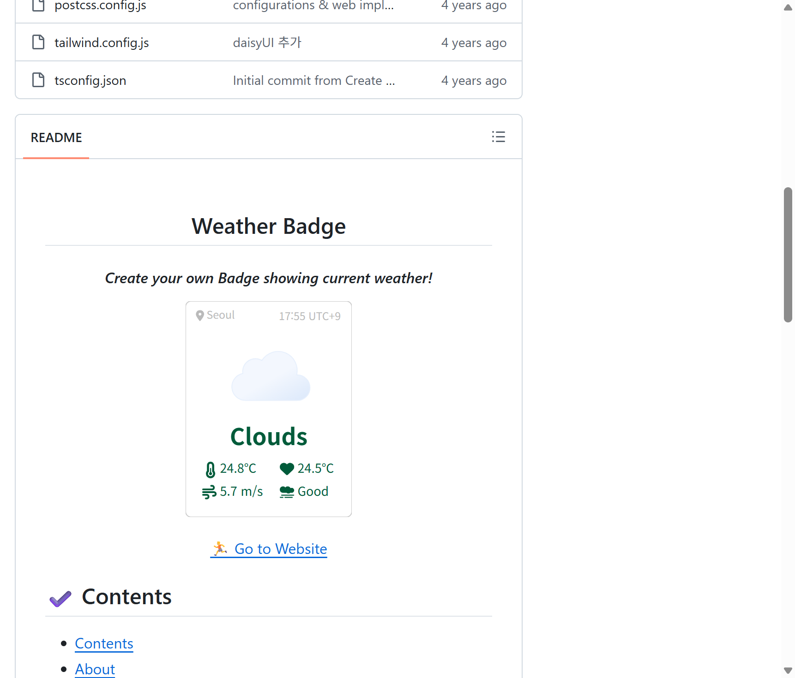
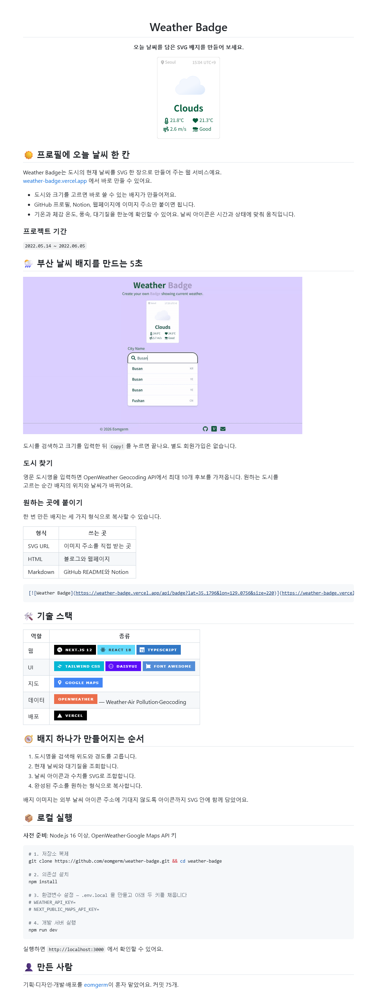
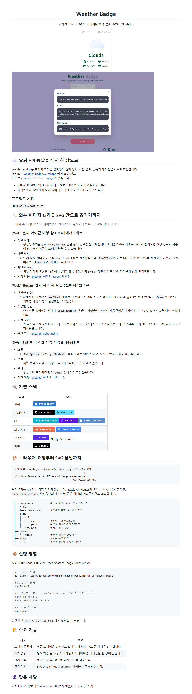

<h1 align="center">k-readme</h1>

<p align="center">
  저장소의 코드와 이력을 읽고, 프로젝트 성격에 맞는 한국어 README를 작성합니다.<br/>
  기술적 문제 해결은 <strong>기술 서사형</strong>으로, 서비스 경험은 <strong>서비스 소개형</strong>으로 보여주세요.
</p>

<p align="center">
  <a href="https://skills.sh/"></a>
  <a href="skills/k-readme/SKILL.md"></a>
  <a href="LICENSE"></a>
</p>

## 설치

```bash
npx --yes skills add eomgerm/k-project-readme-skill -g
```

README를 만들 저장소에서 원하는 모드를 말하면 됩니다.

```text
/k-readme 기술     # 기술적 도전이 맨 앞 (부트캠프 로도 받는다)
/k-readme 서비스   # 기능 데모가 맨 앞 (동아리 로도 받는다)
```

Claude Code와 Codex에만 설치하려면 에이전트를 지정하세요.

```bash
npx --yes skills add eomgerm/k-project-readme-skill -g -a claude-code codex
```

## 같은 저장소, 다른 README

개인 프로젝트 [Weather Badge](https://github.com/eomgerm/weather-badge)를 두 모드로 다시 작성했습니다.
원본은 사용법 중심의 짧은 문서였고, 두 결과물은 같은 근거를 서로 다른 독자에게 맞춰 배치합니다.

### Before — 기존 README



### After — 서비스 소개형 (기능 데모가 맨 앞)

서비스를 처음 보는 사람이 화면과 사용법을 먼저 이해하도록 구성합니다. 데모, 핵심 기능, 활용처가 앞에 옵니다.

<a href="examples/README.service.md">
  
</a>

**[서비스 소개형 README 전체 보기](examples/README.service.md)**

### After — 기술 서사형 (기술적 도전이 맨 앞)

구현 난이도와 판단 근거가 드러나도록 기술적 도전을 기능보다 앞에 둡니다. 커밋으로 확인한 변화도 함께 연결합니다.

<a href="examples/README.tech.md">
  
</a>

**[기술 서사형 README 전체 보기](examples/README.tech.md)**

예시의 서비스 동작은 `demo-gif` 스킬 방식으로 녹화했고, README 화면은 GitHub 마크다운 렌더러로
그린 뒤 Playwright로 캡처했습니다.

## 두 모드의 차이

| | 기술 서사형 | 서비스 소개형 |
| :---: | --- | --- |
| 맨 앞에 오는 것 | 기술적 도전 — 문제·시도·전후 수치 | 기능 데모 — 화면 GIF와 사용법 |
| 핵심 섹션 | 기술적 도전, 아키텍처 | 서비스 소개, 기능 데모, 활용 방법 |
| 주로 읽는 근거 | `fix`·`perf`·`refactor` 커밋, PR, 이슈 | 기획 문서, 배포 주소, 기능 화면 |
| 문서 흐름 | 문제 → 시도 → 확인한 변화 | 화면 → 기능 → 바로 사용하기 |
| 이런 팀이 많이 쓴다 | 부스트캠프, 우테코, 카테캠, SSAFY | SOPT, 디프만, YAPP, 넥스터즈 |
| 저장소를 보고 켜는 블록 | ERD·API 명세·CI/CD 표·폴더 트리 | 스토어 링크·기능 GIF 테이블 |

모드를 고르지 않으면 무엇을 맨 앞에 세울지 한 번 묻습니다. 저장소만 보고 추측하지는 않습니다 — 둘을 가르는 근거가 코드에 없습니다.

## 어떻게 동작하나요?

1. `package.json`, `build.gradle`, `Podfile`, `go.mod` 등에서 실제 기술 스택을 찾습니다.
2. Git 커밋, PR, 이슈와 폴더 구조에서 설명할 만한 근거를 모읍니다.
3. 저장소 특성으로 블록 조건을 판정합니다. 서버 레포면 ERD와 API 명세가, 워크플로가 있으면
   CI/CD 표가 켜집니다. 기여자가 한 명이면 팀원 표 대신 한 줄로 나옵니다.
4. 모드에 따라 맨 앞 블록이 갈립니다. 기술 서사형은 기술적 도전, 서비스 소개형은 기능 데모입니다.
5. 저장소에서 확인할 수 없는 이미지와 수치만 `TODO_...`로 남깁니다.

19개 블록 중 조건이 맞는 것만 조합하기 때문에 저장소마다 섹션 구성이 달라집니다.
팀원 아바타를 채울 때는 `gh`가 있으면 쓰고, 없으면 Git 작성자 이름만 넣습니다.

기존 `README.md`가 있으면 사람이 작성한 내용은 보존하고, 근거 없이 성과 수치를 만들지 않습니다.

## 자동으로 채우는 내용

| 항목 | 확인하는 곳 | 결과 |
| --- | --- | --- |
| 기술 스택 | 의존성·빌드 파일 | 역할별 표 + shields.io 뱃지 |
| 개발 기간 | 첫 커밋과 최근 커밋 | 프로젝트 기간 |
| 기술적 도전 | 커밋, 머지된 PR, 닫힌 이슈 | 문제·시도·결과·근거 링크 |
| 폴더 구조 | 실제 디렉터리 | 한국어 설명이 붙은 트리 |
| 팀원 | GitHub Contributors 또는 Git 작성자 | 아바타와 담당 영역 |
| 실행 방법 | `package.json` 스크립트, `gradlew`, `docker-compose` | 사전 준비와 번호 붙은 실행 절차 |
| API 문서 | `springdoc`·`swagger` 의존성 | Swagger 주소와 확인 URL 표 |
| CI/CD | `.github/workflows/*.yml` | 워크플로·트리거·동작 표와 상태 뱃지 |
| 배포 | GitHub Actions, Vercel, Docker 설정 | 서비스 링크와 배포 구조 |

저장소만으로 알 수 없는 기획 배경이나 역할은 최대 세 가지 질문으로 확인합니다.

## 파일 구성

```text
k-project-readme-skill
├── skills/k-readme
│   ├── SKILL.md
│   └── references
│       ├── structure.md
│       ├── badges.md
│       ├── tone-samples.md
│       └── mobile-demo.md
├── examples
│   ├── README.service.md
│   ├── README.tech.md
│   └── assets/weather-badge
├── assets
│   └── thumbnail.png
├── README.md
└── LICENSE
```

- [스킬 본문](skills/k-readme/SKILL.md): 분석 순서, 블록 조건표, 문체 규칙
- [블록 카탈로그](skills/k-readme/references/structure.md): 19개 블록의 마크업 골격과 변형
- [뱃지 참조](skills/k-readme/references/badges.md): 스택군별 slug·색 50개와 배치 규칙
- [문체 참고](skills/k-readme/references/tone-samples.md): 한국 프로젝트 문서의 종결어미와 리듬
- [모바일 데모](skills/k-readme/references/mobile-demo.md): 앱 화면 GIF 제작 절차

## 만든 사람

<p align="center">
  <a href="https://github.com/eomgerm">
    <br/>
    <strong>eomgerm</strong>
  </a>
</p>

## 라이선스

[MIT License](LICENSE)
