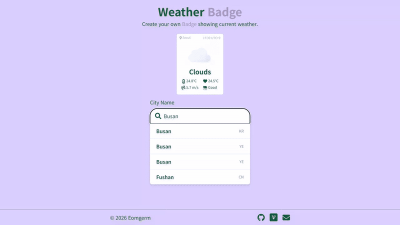

<div align="center">
  <h1>Weather Badge</h1>
  <p><strong>위치별 실시간 날씨를 어디서나 쓸 수 있는 SVG로 만듭니다.</strong></p>
  <a href="https://weather-badge.vercel.app/">
    
  </a>
</div>



## ☁️ 날씨 API 응답을 배지 한 장으로

Weather Badge는 도시와 크기를 입력받아 현재 날씨, 체감 온도, 풍속과 대기질을 SVG로 조합합니다.
서비스는 [weather-badge.vercel.app](https://weather-badge.vercel.app/) 에 배포돼 있고,
코드는 [eomgerm/weather-badge](https://github.com/eomgerm/weather-badge) 에 있습니다.

- GitHub README와 Notion에서는 생성된 URL만 이미지로 붙이면 됩니다.
- 아이콘까지 SVG 안에 담겨 있어 배지 주소 하나로 렌더링이 끝납니다.

### 프로젝트 기간

`2022.05.14 ~ 2022.06.05`

## 🔧 외부 이미지 13개를 SVG 안으로 옮기기까지

> 배지 주소 하나만으로 아이콘까지 렌더링되도록 SVG의 외부 의존성을 없앴습니다.

### [Web] 날씨 아이콘 외부 참조 13개에서 0개로

- **처음 문제**
    - 생성된 SVG는 `/animated/day.svg` 같은 상대 경로를 참조했습니다. 배지를 GitHub나 Notion에서 불러오면 해당 경로의 기준이 달라져 아이콘이 보이지 않을 수 있었습니다.
- **바꾼 방식**
    - 13개 날씨 상태 아이콘을 Base64 Data URI로 변환했습니다. `IconSVGMap`이 경로 대신 인코딩된 SVG를 반환하게 바꾸고, 완성 배지의 `<image href>`에 바로 넣었습니다.
- **확인한 결과**
    - 외부 이미지 요청은 13개에서 0개가 됐습니다. 배지 SVG 한 장만 받아도 날씨 아이콘이 함께 렌더링됩니다.
- 변경 내용: [`da0afdf` 이미지 Base64로 변경](https://github.com/eomgerm/weather-badge/commit/da0afdfccb2608ddb5c35700b1db5654675d2263)

### [Web] `Busan` 입력 시 도시 요청 5번에서 1번으로

- **발견한 상황**
    - 자동완성 입력값을 `useEffect`가 바로 구독해 글자 하나를 입력할 때마다 Geocoding API를 호출했습니다. `Busan`을 연속 입력하면 다섯 요청이 발생하는 구조였습니다.
- **적용한 방법**
    - 타이머를 정리하는 제네릭 `useDebounce<T>` 훅을 추가했습니다. 현재 자동완성은 마지막 입력 후 200ms가 지났을 때만 요청합니다.
- **재현 결과**
    - 각 글자를 200ms 안에 입력하는 기준에서 요청이 5번에서 1번으로 줄었습니다. 같은 훅을 배지 URL 갱신에도 300ms 간격으로 재사용했습니다.
- 구현 기록: [`5a3a5af` debouncing](https://github.com/eomgerm/weather-badge/commit/5a3a5af61dfbec3d568fa3a9cad29dd7b621cfcb)

### [SVG] `9:5`로 나오던 지역 시각을 `09:05`로

- **오류**
    - `Date#getHours()`와 `getMinutes()` 값을 그대로 이어 한 자리 시각의 앞자리 `0`이 빠졌습니다.
- **수정**
    - 시와 분을 문자열로 바꾸고 길이가 1일 때 각각 `0`을 붙였습니다.
- **결과**
    - `9:5`처럼 출력되던 값이 `09:05` 형식으로 고정됐습니다.
- 관련 커밋: [`7b66543` 한 자리 시각 수정](https://github.com/eomgerm/weather-badge/commit/7b66543d64caa7eea31f34e4762b50c0a82a877d)

## 🛠 기술 스택

| 역할 | 종류 |
| --- | --- |
| 언어 |  |
| 프레임워크 |   |
| UI |    |
| 외부 API |   |
| 네트워크 |  · Next.js API Routes |
| 배포 |  |

## 🏗 브라우저 요청부터 SVG 응답까지

```text
도시 입력 → /api/geo → OpenWeather Geocoding → 위도·경도 선택
                                                    ↓
GitHub·Notion·Web ← SVG 조합 ← /api/badge → Weather API
                                          → Air Pollution API
```

브라우저는 API 키를 직접 가지지 않습니다. Next.js API Routes가 외부 날씨 API를 호출하고,
`server/utils/svg.ts`에서 응답과 내장 아이콘을 하나의 SVG 문자열로 조합합니다.

```text
├── components             # 도시 입력, 지도, 복사 모달 UI
├── hooks
│   └── useDebounce.ts     # 입력과 배지 URL 갱신 지연
├── pages
│   ├── api
│   │   ├── badge.ts       # SVG 응답 엔드포인트
│   │   └── geo.ts         # 도시 자동완성 엔드포인트
│   └── index.tsx          # 배지 생성 화면
├── server
│   └── utils              # 날씨 요청과 SVG 조합
├── types                  # API 응답 타입
└── utils                  # 쿼리 문자열과 날씨 아이콘 매핑
```

## 📦 실행 방법

**사전 준비**: Node.js 16 이상, OpenWeather·Google Maps API 키

```bash
# 1. 저장소 복제
git clone https://github.com/eomgerm/weather-badge.git && cd weather-badge

# 2. 의존성 설치
npm install

# 3. 환경변수 설정 — .env.local 을 만들고 아래 두 키를 채웁니다
# WEATHER_API_KEY=
# NEXT_PUBLIC_MAPS_API_KEY=

# 4. 개발 서버 실행
npm run dev
```

실행하면 `http://localhost:3000` 에서 확인할 수 있습니다.

## 🌤 주요 기능

| 기능 | 설명 |
| --- | --- |
| 도시 자동완성 | 영문 도시명을 검색하고 최대 10개 위치 후보 중 하나를 선택합니다. |
| SVG 생성 | 날씨·체감 온도·풍속·대기질과 애니메이션 아이콘을 한 장에 담습니다. |
| 크기 조절 | 쿼리의 `size` 값으로 배지 크기를 바꿉니다. |
| 코드 복사 | SVG URL, HTML, Markdown 형식을 바로 확인합니다. |

## 👤 만든 사람

기획·디자인·개발·배포를 [eomgerm](https://github.com/eomgerm)이 혼자 맡았습니다. 커밋 75개.
